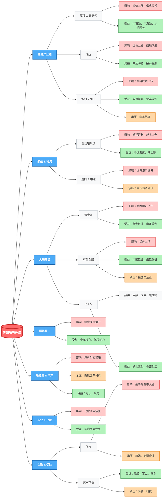

```mermaid
graph LR
    %% 定义样式类 (无 Emoji)
    classDef rootStyle fill:#ff6b6b,stroke:#c92a2a,stroke-width:3px,color:#fff,font-size:18px,font-weight:bold;
    classDef categoryStyle fill:#4dabf7,stroke:#1864ab,stroke-width:2px,color:#fff,font-weight:bold;
    classDef impactStyle fill:#ffc9c9,stroke:#e03131,stroke-width:1px,color:#333;
    classDef benefitStyle fill:#b2f2bb,stroke:#2b8a3e,stroke-width:1px,color:#333;
    classDef pressureStyle fill:#ffd8a8,stroke:#e67700,stroke-width:1px,color:#333;
    classDef neutralStyle fill:#f8f9fa,stroke:#adb5bd,stroke-width:1px,color:#333;

    %% 根节点
    Root[("伊朗局势升级")]:::rootStyle

    %% 一级分类节点
    Energy[能源产业链]:::categoryStyle
    Shipping[航运 & 物流]:::categoryStyle
    Commodity[大宗商品]:::categoryStyle
    Defense[国防军工]:::categoryStyle
    NewEnergy[新能源 & 汽车]:::categoryStyle
    Agriculture[农业 & 化肥]:::categoryStyle
    Finance[金融 & 保险]:::categoryStyle

    %% 连接根节点到一级分类
    Root --> Energy
    Root --> Shipping
    Root --> Commodity
    Root --> Defense
    Root --> NewEnergy
    Root --> Agriculture
    Root --> Finance

    %% --- 能源产业链 ---
    Oil[原油 & 天然气]:::neutralStyle
    OilTrans[油运]:::neutralStyle
    Refine[炼油 & 化工]:::neutralStyle
    
    Energy --> Oil
    Energy --> OilTrans
    Energy --> Refine

    Oil --> OilImp[影响：油价上涨、供应收紧]:::impactStyle
    Oil --> OilBen[受益：中石油、中海油、沙特阿美]:::benefitStyle

    OilTrans --> TransImp[影响：运价上涨、航线改道]:::impactStyle
    OilTrans --> TransBen[受益：中远海能、招商轮船]:::benefitStyle

    Refine --> RefImp[影响：原料成本上行]:::impactStyle
    Refine --> RefBen[受益：华鲁恒升、宝丰能源]:::benefitStyle
    Refine --> RefPre[承压：山东地炼]:::pressureStyle

    %% --- 航运 & 物流 ---
    Container[集装箱航运]:::neutralStyle
    PortLog[港口 & 物流]:::neutralStyle

    Shipping --> Container
    Shipping --> PortLog

    Container --> ConImp[影响：航程延长、成本上升]:::impactStyle
    Container --> ConBen[受益：中远海运、马士基]:::benefitStyle

    PortLog --> PortImp[影响：区域港口拥堵]:::impactStyle
    PortLog --> PortPre[承压：中东沿线港口]:::pressureStyle

    %% --- 大宗商品 ---
    Metal[贵金属]:::neutralStyle
    NonFerrous[有色金属]:::neutralStyle
    Chem[化工品]:::neutralStyle

    Commodity --> Metal
    Commodity --> NonFerrous
    Commodity --> Chem

    Metal --> MetImp[影响：避险需求上升]:::impactStyle
    Metal --> MetBen[受益：紫金矿业、山东黄金]:::benefitStyle

    NonFerrous --> NonImp[影响：铝价上行]:::impactStyle
    NonFerrous --> NonBen[受益：中国铝业、云铝股份]:::benefitStyle
    NonFerrous --> NonPre[承压：铝加工企业]:::pressureStyle

    Chem --> ChemVar[品种：甲醇、尿素、碳酸锶]:::neutralStyle
    Chem --> ChemBen[受益：湖北宜化、鲁西化工]:::benefitStyle

    %% --- 国防军工 ---
    Defense --> DefImp[影响：地缘风险提升]:::impactStyle
    Defense --> DefBen[受益：中航沈飞、航发动力]:::benefitStyle

    %% --- 新能源 & 汽车 ---
    NewEnergy --> NewImp[影响：原料供应紧张]:::impactStyle
    NewEnergy --> NewPre[承压：新能源车材料]:::pressureStyle
    NewEnergy --> NewBen[受益：光伏、风电]:::benefitStyle

    %% --- 农业 & 化肥 ---
    Agriculture --> AgrImp[影响：化肥供应紧张]:::impactStyle
    Agriculture --> AgrBen[受益：国内尿素龙头]:::benefitStyle

    %% --- 金融 & 保险 ---
    Insurance[保险]:::neutralStyle
    Capital[资本市场]:::neutralStyle

    Finance --> Insurance
    Finance --> Capital

    Insurance --> InsImp[影响：战争险费率大涨]:::impactStyle
    Insurance --> InsPre[承压：航运、能源企业]:::pressureStyle

    Capital --> CapBen[受益：能源、军工、黄金]:::benefitStyle
    Capital --> CapPre[承压：消费、科技]:::pressureStyle
```
