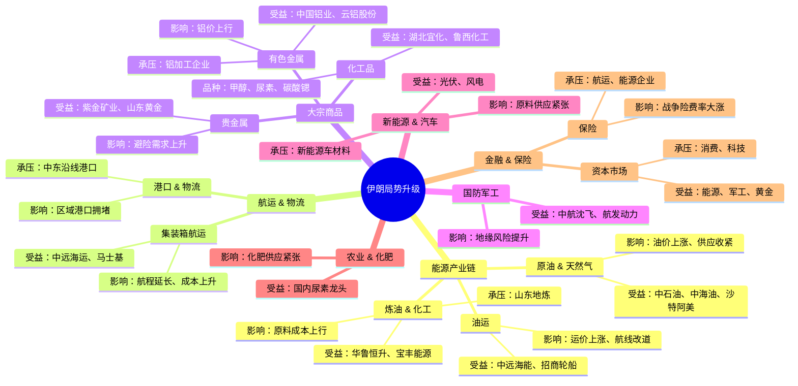

```mermaid
mindmap
  root((伊朗局势升级))
    能源产业链
      原油 & 天然气
        影响：油价上涨、供应收紧
        受益：中石油、中海油、沙特阿美
      油运
        影响：运价上涨、航线改道
        受益：中远海能、招商轮船
      炼油 & 化工
        影响：原料成本上行
        受益：华鲁恒升、宝丰能源
        承压：山东地炼
    航运 & 物流
      集装箱航运
        影响：航程延长、成本上升
        受益：中远海运、马士基
      港口 & 物流
        影响：区域港口拥堵
        承压：中东沿线港口
    大宗商品
      贵金属
        影响：避险需求上升
        受益：紫金矿业、山东黄金
      有色金属
        影响：铝价上行
        受益：中国铝业、云铝股份
        承压：铝加工企业
      化工品
        品种：甲醇、尿素、碳酸锶
        受益：湖北宜化、鲁西化工
    国防军工
      影响：地缘风险提升
      受益：中航沈飞、航发动力
    新能源 & 汽车
      影响：原料供应紧张
      承压：新能源车材料
      受益：光伏、风电
    农业 & 化肥
      影响：化肥供应紧张
      受益：国内尿素龙头
    金融 & 保险
      保险
        影响：战争险费率大涨
        承压：航运、能源企业
      资本市场
        受益：能源、军工、黄金
        承压：消费、科技
```
